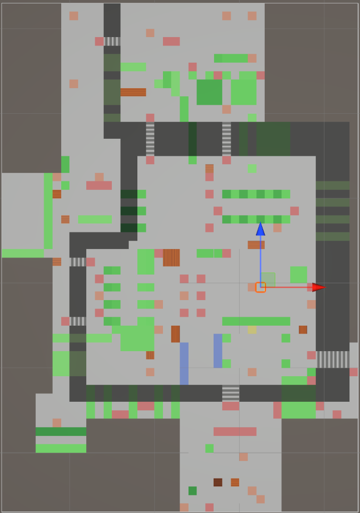

# ROBO-Path 대시보드 UI 설계 및 구현 명세 (Dashboard UI Implementation Spec)

본 문서는 `ROBO-Path` 프로젝트의 프레젠테이션 계층(Streamlit 대시보드)에 대한 전반적인 UI 아키텍처 및 세부 설계 명세이다. 
현재 `main` 브랜치에는 단순 PoC 수준의 `app.py`만 존재하며, 아래 명시된 구조 및 기능들은 모두 **설계 초안(미구현)** 상태이다.
향후 백엔드(Supabase, FastAPI) 연동 시 구조적 변경을 최소화하고 완벽한 호환성을 보장하기 위한 단일 기준점(Single Source of Truth) 역할을 수행한다.

---

## 1. 개요 및 아키텍처 (Overview & Architecture)

### 1.1 기술 스택
- **프레임워크:** Streamlit (v1.35 이상 권장, `on_select` 양방향 통신 지원)
- **시각화:** Plotly (`plotly.graph_objects`)
- **스타일링:** 커스텀 CSS (Glassmorphism, Dark Theme 강제) 및 `.streamlit/config.toml` 환경설정

### 1.2 디렉토리 구조 (설계 초안)
- `src/presentation/dashboard/app.py`: 메인 엔트리 포인트 및 글로벌 설정, 라우팅 관리 (현재 PoC 구현됨)
- `src/presentation/dashboard/pages/`: 각 도메인별 기능 페이지 (Auth, Home, Path Planning, Map Data, Robots, Settings) - 미구현
- `src/presentation/dashboard/components/`: 재사용 가능한 UI 컴포넌트 모듈 (3D Viewer 등) - 미구현
- `src/presentation/dashboard/i18n.py`: 다국어(한국어/영어) 지원 모듈 - 미구현

### 1.3 시뮬레이터 맵 (Simulation Map)

*실제 시뮬레이터 맵의 Top-view. 해당 이미지는 2D 경로 탐색 지도의 배경으로 활용된다.*

---

## 2. 대시보드 핵심 컴포넌트 설계 (Dashboard UI Components)

> ⚠️ **주의:** 본 섹션의 모든 기능은 `ROBO-Path_Dashboard_Data_Contract.md`에 정의된 데이터 규격을 엄격히 따른다. 목업이나 UI 설계상 하드코딩된 특정 예시 수치(예: "9대 중 3/0/3/3/0")는 참고용 예시일 뿐이며, 실제 런타임에서는 DB 데이터를 기반으로 한 동적 집계 쿼리로 렌더링된다.

### 2.1 로봇 플릿 상태 (Fleet Status - 좌측 사이드바)
- **로봇 식별:** 로봇 식별은 `robots.name` (예: "Wheeled-01") 필드를 그대로 사용한다. 별도의 친근한 ID(RP-01 등) 체계는 도입하지 않는다.
- **로봇 상태 배지:** 총 5종의 상태를 가지며, Data Contract(2.1절)에 명시된 색상 매핑을 엄격히 준수한다.
  - `Idle` (회색) / `Charging` (녹색) / `Delivery` (주황색) / `Exploring` (하늘색) / `Returning` (보라색)
- **배터리 및 텔레메트리 표출:** 
  - 화면에 표시되는 텔레메트리 정보는 실측 센서값이 아니며, 백엔드 로직에 의해 근사 계산된 값이다.
  - 데이터 출처: `robots.battery_pct` (거리/거점 기반 간이 모델 연산), `robots.current_speed_mps`, `missions.started_at`, `missions.accumulated_cost`.

### 2.2 임무 현황 및 통계 (Analytics & Logs - 우측 사이드바)
- **임무 워크플로 관리:** 기존 로그 기반 상태 대신 `missions` 테이블을 기반으로 임무 현황을 렌더링한다. 상태값은 `Pending`, `Active`, `Completed`, `Failed` enum 값으로 통일한다.
- **회수(Recall) 알림:** 우측 상단 알림 벨 아이콘은 `missions.status='Failed'` 중 미확인 건수를 카운트하여 Red Dot으로 표시한다. 단, 알림을 통한 **수동 회수 조작 버튼 기능은 Step 3 이후 구현 예정(후속 과제)**이다.[^1]

### 2.3 맵 컨트롤 및 상호작용 (중앙 뷰어)
- **탐색(Discovery) 상태 표출:** A* 경로 및 미탐색 영역(Fog of War)을 표시한다. 탐색된 구역이 맵에 즉각 반영되기 위해서는 백엔드의 `DISCOVERY` 페이로드 처리 및 `discovered_nodes` 테이블 적재 파이프라인 연결이 선행되어야 한다.[^2]
- **Set Goal 버튼 (목적지 지정):** 웹 화면에서 직접 맵을 클릭해 목적지를 지정하는 기능은 이번 1차 구현 범위에서 **제외(후속 과제)**되었다.

---

## 3. 기능 모듈 세부 설계 초안 (Draft Features)

아래 설계된 구조는 향후 백엔드 연동 시 유연성을 확보하기 위해 모듈화를 지향한다.

### 3.1 통합 테마 및 CSS 격리 시스템
- **동작 방식:** `app.py` 최상단에서 글로벌 CSS를 주입하여 Streamlit의 기본 흰색 테마를 무력화하고, `radial-gradient`와 `backdrop-filter(blur)`를 활용한 사이버펑크 스타일의 다크 글래스모피즘 룩을 강제한다.
- **백엔드 호환성:** UI 컴포넌트 시각화 계층이 분리되어 있으므로, 데이터 렌더링 로직만 백엔드 데이터로 교체하면 디자인이 그대로 유지된다.
- **환경 설정:** `.streamlit/config.toml`을 통해 Streamlit 네이티브 메뉴를 숨겨 비인가 사용자의 테마 임의 변경을 원천 차단한다.

### 3.2 인증 및 세션 파이프라인 (Auth & Session Pipeline)
- **참고 문서:** `ROBO-Path_Auth_Design.md`
- **목업 설계 로직 (미구현):** `auth.py`에서 인증키(Secret Key) 검증 시 임시 세션(`st.session_state`)을 부여하는 로직으로 초안을 구성.
- **백엔드 연동 시 전환 절차:**
  1. FastAPI Auth 라우터를 호출하여 발급받은 JWT를 브라우저의 HTTP-Only 보안 쿠키에 저장.
  2. 쿠키 기반 세션 처리를 통해 탭/브라우저 종료 시 완벽한 자동 로그아웃이 이루어지도록 변경.

### 3.3 다중 페이지 및 다국어 구조 (Navigation & I18n)
- **라우팅:** `st.navigation` 객체를 사용하여 인증 상태에 따라 `[로그인]`, `[메인 대시보드]`, `[데이터 관리]` 계층의 트리를 동적으로 구성한다. (미구현)
- **다국어 (I18n):** 화면 하드코딩 문자열을 제거하고 `i18n.py` 모듈을 통해 세션 상태에 따라 한국어/영어가 실시간 전환되도록 설계. (미구현)

---

## 4. 3D 탐색 영역 시각화 명세 (3D Map Visualization Spec)

본 모듈은 2D 지도와 연동되어, 사용자가 클릭한 구역의 로컬 3D 지형을 조감하는 기능이다.
⚠️ **참고:** "0.1m³까지 조밀해지는 동적 복셀", "바이너리 옥트리 스트리밍", "실시간 보행 애니메이션" 등의 고도화된 기능은 이번 범위에서 제외되어 **후속 과제(미구현)**로 이관되었다. 1차 구현에서는 단순 2D 뷰 및 **단순 정적 격자(Voxel) 시각화** 수준으로 범위를 하향 조정한다.

### 4.1 호환성 및 데이터 모델 (Critical)
이 모듈은 향후 **실제 Unity 시뮬레이터에서 덤프될 데이터(`scene_dump.json`) 구조와 100% 호환**되도록 설계된다.
- **참고 문서:** `ROBO-Path_Scene_Dump_Specification.md`
- **입력 데이터 구조:** 3D 뷰어 컴포넌트는 반드시 아래 형태의 딕셔너리 배열을 입력 인자(Arguments)로 받아야 한다.
  ```json
  [
    {
      "id": "Flat_10_x1_z2_y5_r0",
      "tag": "Terrain_Flat",
      "position": {"x": 10, "y": 5, "z": 20},
      "size": {"x": 10, "y": 10, "z": 10}
    }
  ]
  ```

### 4.2 단계별 작업 흐름 (Implementation Workflow)

#### Step 1: Mock 3D 데이터 제너레이터 구현 (`map_3d_viewer.py`)
- 특정 기준 좌표를 입력받아 평지(`Terrain_Flat`), 경사/계단(`Terrain_Slope`) 정보를 담은 배열(scene_dump 호환)을 생성하는 가상 생성기 구현. (미구현)

#### Step 2: Plotly 기반 단순 정적 3D 렌더링 로직 구현 (`map_3d_viewer.py`)
- 호환성이 높고 가벼운 `plotly.graph_objects.Scatter3d` 사용.
- 각 지형 블록을 3D Scatter 큐브 마커로 표현하며, `tag` 에 따라 색상을 다르게 적용(예: 평지는 짙은 파랑, 계단은 밝은 보라색)한다.

#### Step 3: 2D 이벤트 캡처 및 UI 통합
- 2D Plotly 차트에 `on_select="rerun"` 이벤트 캡처를 추가하여, 클릭 시 선택된 구역의 정보를 담은 3D 렌더링 모듈을 즉각 표출한다.

---

## 5. 백엔드 전환 시 체크리스트 (Future Backend Integration)
- [ ] `auth.py`: 하드코딩된 비밀번호 체계를 FastAPI JWT 로그인 라우터로 변경 및 세션 쿠키 제어기 연결.
- [ ] `app.py`: 초기 실행 시 DB Connection 확인 및 데이터 동기화 파이프라인 활성화 (기존 PoC 고도화).
- [ ] `map_3d_viewer.py`: `generate_mock_scene_dump()` 함수를 `fetch_scene_dump_from_api()` 로 교체.

---
[^1]: 아키텍처 문서 9.1절에 따라, 회수(Recall) 명령 직접 조작 기능은 로봇/미션 시스템 구축 완료 후(Step 3 이후) 구현 예정.
[^2]: 현재 `push_feedback.py`가 `DISCOVERY` 타입 페이로드를 임시로 무시하고 있으므로, 파이프라인 구현 전까지는 UI에서 탐색 현황이 표출되지 않는다. (Data Contract 4.1절 참조)
