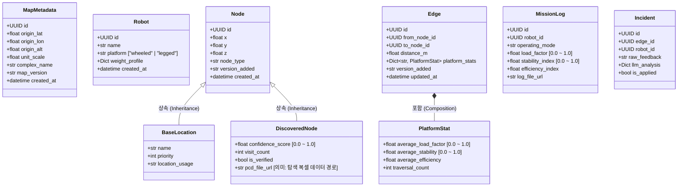

# ROBO-Path 도메인 모델 아키텍처 설계서 (Domain Models Architecture)

이 문서는 ROBO-Path 시스템의 핵심 비즈니스 데이터를 표현하고 검증하는 **순수 도메인 모델(Pydantic 기반)**의 설계 원칙과 상세 구조를 문서화합니다.

---

## 1. 개요 및 설계 철학 (Overview & Design Philosophy)

도메인 모델 계층(`src/domain/models/`)은 클린 아키텍처의 가장 안쪽(Center)에 위치합니다. 
이 계층은 시스템의 '무결성'을 책임지며, 외부 프레임워크나 데이터베이스 기술에 의존하지 않고 오직 Python 기본 문법과 `Pydantic` 라이브러리만을 사용하여 구현되었습니다.

- **순수성 (Purity):** `SQLAlchemy`, `Supabase Client`, `Streamlit` 등의 외부 의존성이 전혀 없습니다.
- **다형성 (Polymorphism):** `Node` 모델은 부모 클래스로 작동하며, 인간 정의 노드와 로봇 탐험 노드를 자식 클래스로 분리하여 속성을 격리합니다.
- **엄격한 검증 (Strict Validation):** 단순 타입 체크를 넘어, 정규표현식(`wheeled|legged`), 값의 범위 제약(`0.0 ~ 1.0`) 등 비즈니스 규칙을 `Pydantic Field` 레벨에서 원천 차단합니다.

---

## 2. 도메인 모델 클래스 다이어그램 (Class Diagram)

---

## 3. 핵심 모델 상세 명세 (Detailed Specifications)

### 3.1 공간 메타데이터 (`metadata.py`)
- **MapMetadata**: 3차원 공간 맵의 원점 GPS 좌표($Latitude, Longitude$)와 버전을 관리합니다. 시뮬레이터(Isaac Sim)의 원점과 현실 세계를 동기화하는 기준점입니다.
- **Robot**: 프로젝트에 등록된 로봇의 기종을 검증합니다. `platform` 속성은 반드시 `wheeled` 또는 `legged` 여야 하며 정규식(`^(wheeled|legged)$`)으로 보호됩니다.

### 3.2 노드 다형성 계층 (`node.py`)
- **Node (Base)**: 모든 경유점이 공통적으로 가지는 3차원 지역 좌표($X, Y, Z$)를 정의합니다.
- **BaseLocation**: 충전소, 엘리베이터 등 **인간이 사전 정의한** 목적지 노드입니다. 고신뢰 데이터를 의미하며, `name`과 `priority`를 가집니다.
- **DiscoveredNode**: 로봇이 자율 탐험(Exploration) 중 **스스로 발견한** 경유점입니다. AI 분석 결과에 따른 `confidence_score`를 가지며, 0.0에서 1.0 사이의 값으로 Pydantic 제약(`ge=0.0, le=1.0`)이 적용되어 있습니다. `pcd_file_url` 속성은 이름과 달리 현재 3D 포인트 클라우드가 아닌 탐색 복셀 데이터(Octree 직렬화 파일) 경로를 의미합니다.

### 3.3 연결성 및 가중치 통계 (`edge.py`)
- **Edge**: `from_node_id`와 `to_node_id`를 연결하는 경로입니다. 순수 물리적 거리인 `distance_m`은 무조건 0보다 커야 합니다(`gt=0.0`).
- **PlatformStat (Value Object)**: 엣지가 가지는 **하드웨어 피드백 통계(가중치)**입니다. Edge의 `platform_stats` 딕셔너리 내부에 값 객체로 포함되어, 특정 기종(예: 'wheeled')이 해당 엣지를 통과할 때의 부하율 평균(`average_load_factor`), 안정성 평균(`average_stability`) 등을 보관합니다. 이 지표들은 추후 A* 알고리즘의 Cost 계산에 직접적으로 사용됩니다.

### 3.4 로그 및 자연어 피드백 (`log.py`)
- **MissionLog**: 로봇이 주행 임무를 마치면 기록되는 성적표입니다. `load_factor` 및 `stability_index`는 반드시 $0.0 \sim 1.0$ 사이로 검증됩니다. 이 모델 데이터는 누적되어 Edge의 PlatformStat을 갱신합니다.
- **Incident**: 작업자의 "이 구간은 바퀴가 자주 미끄러져서 위험해"와 같은 비정형 자연어 피드백(`raw_feedback`)과, 이를 Gemini API 등 LLM이 구조화한 JSON 데이터(`llm_analysis`)를 보관합니다.

---

## 4. 데이터베이스 매핑 전략 (DB Mapping Strategy)

순수 도메인 모델은 DB의 구조를 전혀 알지 못합니다. 대신, `Infrastructure` 계층의 Repository 패턴에서 이 모델들을 생성(Mapping)합니다.

- **상속(Inheritance)의 DB 처리**: DB의 `nodes` 테이블은 단일 테이블 또는 조인 구조일 수 있습니다. 파이썬 `Infrastructure` 계층에서는 DB 데이터를 읽어온 뒤 `node_type` 컬럼을 확인하여, `BASE`면 `BaseLocation` 인스턴스를 생성하고 `DISCOVERED`면 `DiscoveredNode` 인스턴스를 생성하여 반환합니다.
- **JSONB 변환**: `map_edges` 테이블의 `platform_stats` 컬럼(JSONB 타입)은 `Edge` 모델의 파이썬 내부 `Dict[str, PlatformStat]`으로 자동 변환(역직렬화)되어 도메인 로직(알고리즘)에서 타입 힌트와 자동 완성을 지원받으며 안전하게 계산됩니다.
